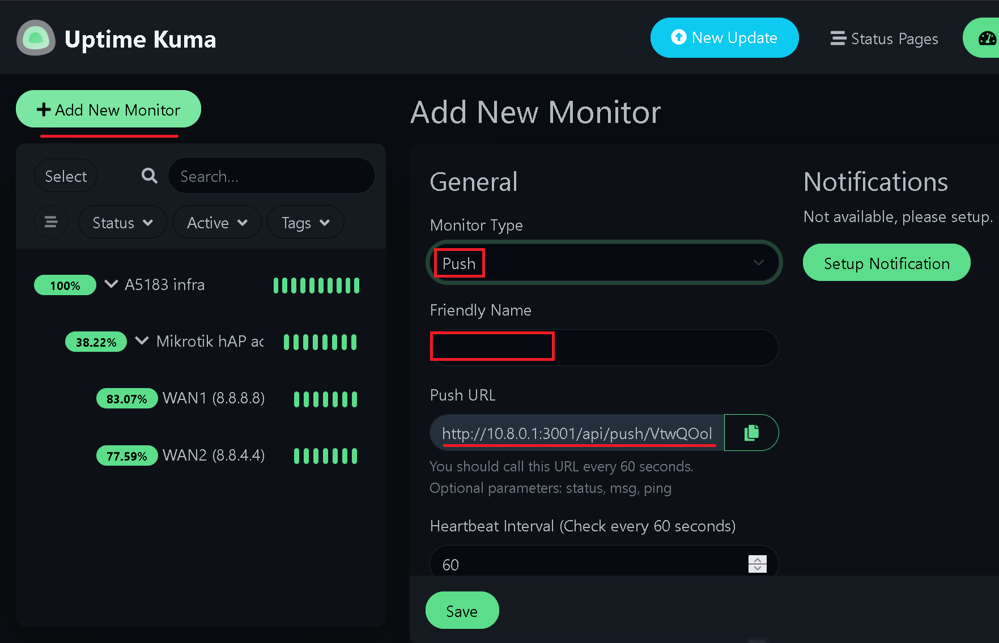

# Monitoring WAN ports

This page complements [2-WAN failover setup](2-wan-dhcp-failover-rec-route) and enables monitoring of the WAN interfaces.
10.8.0.1 is an IP address of the Wireguard server, where there is [Uptime Kuma](https://uptimekuma.org) monitoring server set up at port 3001.

The idea is that a router monitors its WAN interfaces and notifies the monitoring server over the private monitoring WG tunnel.
First we need to create a push monitor in Uptime Kuma via its web interface:

<p></p>

Our device needs to periodically ping that **Push URL** for status updates. In this example, we create 2 named scripts, `kuma-wan1-heartbeat` and `kuma-wan2-heartbeat`:

```
/system script add name=kuma-wan1-heartbeat dont-require-permissions=yes source= {
:local r [/ping 8.8.8.8 count=3 interface=ether1];
:if ($r > 0) do={
    /tool fetch url="http://10.8.0.1:3001/api/push/<APIKEY>?status=up&msg=OK" output=none;
} else={
    /tool fetch url="http://10.8.0.1:3001/api/push/<APIKEY>?status=down&msg=FAIL" output=none;
}
}

/system script add name=kuma-wan2-heartbeat dont-require-permissions=yes source= {
:local r [/ping 8.8.4.4 count=3 interface=ether2 ];
:if ($r > 0) do={
    /tool fetch url="http://10.8.0.1:3001/api/push/<APIKEY>?status=up&msg=OK" output=none;
} else={
    /tool fetch url="http://10.8.0.1:3001/api/push/<APIKEY>?status=down&msg=FAIL" output=none;
}
}
```

Here we ping 8.8.8.8 via `ether1` WAN interface and 8.8.4.4 via `ether2` and then report the result to the URL.
Now we need to add two Netwatch rules, `WAN1-mon` and `WAN2-mon` to our Mikrotik to run the scripts:

```
/tool netwatch
add disabled=no down-script="" host=8.8.8.8 interval=1m name=WAN1-mon \
    test-script=kuma-wan1-heartbeat type=simple up-script=""
add disabled=no down-script="" host=8.8.4.4 interval=1m name=WAN2-mon \
    test-script=kuma-wan2-heartbeat type=simple up-script=""
```

Note, the interval. It's 1 minute which matches 60 seconds window the Uptime Kuma monitor expects to receive a heartbeat within.
Now, verify the Uptime Kuma web UI and check Mikrotik's log. If everything is configured correctly, in the log you'll a lot of messages like
> Download from 10.8.0.1 FINISHED

in `fetch, info` topic. To suppress them, add `!fetch` to your existing `info` logging rules:
<p></p>
